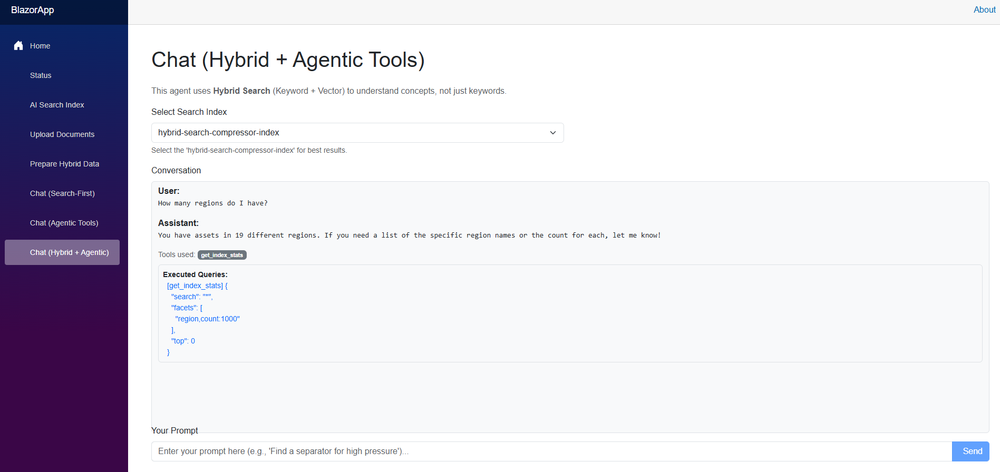

# Azure AI Search Diagnostics

A Blazor application for testing and optimizing Azure AI Search with Azure OpenAI models, featuring Agentic Workflows and Hybrid Search.



## Features

### 1. Agentic Chat
- **Intelligent Orchestration**: Uses GPT-4 to dynamically select tools based on user intent.
- **Tools**:
  - `search_index`: Semantic search for concepts.
  - `lookup_asset`: Direct retrieval by ID.
  - `get_stats`: Aggregations and facet analysis.
- **Transparency**: UI displays exact tool calls and executed queries.

### 2. Hybrid Search (Vector + Keyword)
- **Architecture**: Combines BM25 (Keyword) and HNSW (Vector) algorithms.
- **Embeddings**: Uses `text-embedding-3-large` (1536 dimensions).
- **Implementation**: `HybridSearchTool` automatically vectorizes user queries for conceptual matching.

### 3. Data Preparation
- **Built-in Tool**: `PrepareHybridData` page to generate embeddings for JSON datasets.
- **Azure Integration**: Direct connection to Azure OpenAI for batch embedding generation.

## Architecture

- **Frontend**: Blazor Web App (.NET 9)
- **AI Orchestration**: Azure OpenAI (GPT-4.1)
- **Search Engine**: Azure AI Search (Standard S1)
- **Security**: Managed Identity / RBAC (No API Keys)

## Getting Started

### Prerequisites
- Azure Subscription
- **Azure OpenAI Service**: You must have an existing Azure OpenAI resource with the following models deployed:
  - **GPT-4** (e.g., `gpt-4` or `gpt-4o`)
  - **Embeddings** (e.g., `text-embedding-3-large`)
- [Azure CLI](https://docs.microsoft.com/en-us/cli/azure/install-azure-cli) or [Azure Developer CLI (azd)](https://learn.microsoft.com/en-us/azure/developer/azure-developer-cli/install-azd)
- [.NET 9 SDK](https://dotnet.microsoft.com/download/dotnet/9.0)

### 1. Deploy Infrastructure
This project uses `azd` to provision the Azure AI Search service.

```bash
azd up
```

### 2. Configure Local Settings
Create or update `src/BlazorApp/appsettings.Development.json` with your Azure endpoints. You will need the endpoint and deployment names from your Azure OpenAI resource, and the endpoint from the created Azure AI Search service.

```json
{
  "AzureSettings": {
    "AzureAI": {
      "Endpoint": "https://<your-openai-resource>.openai.azure.com/",
      "GptDeploymentName": "gpt-4",
      "EmbeddingDeploymentName": "text-embedding-3-large"
    },
    "AzureSearch": {
      "Endpoint": "https://<your-search-service>.search.windows.net"
    }
  }
}
```

### 3. Run Application

```bash
dotnet watch run --project src/BlazorApp/BlazorApp.csproj
```

### 4. Setup Hybrid Search
Once the application is running:
1.  **Create Index**: Navigate to the "AI Search Index" page and use the JSON definition from `indexes/hybrid/` to create your index.
2.  **Generate Embeddings**: Go to the "Prepare Hybrid Data" page.
3.  **Upload Data**: Use the "Upload Documents" page to index your data.
